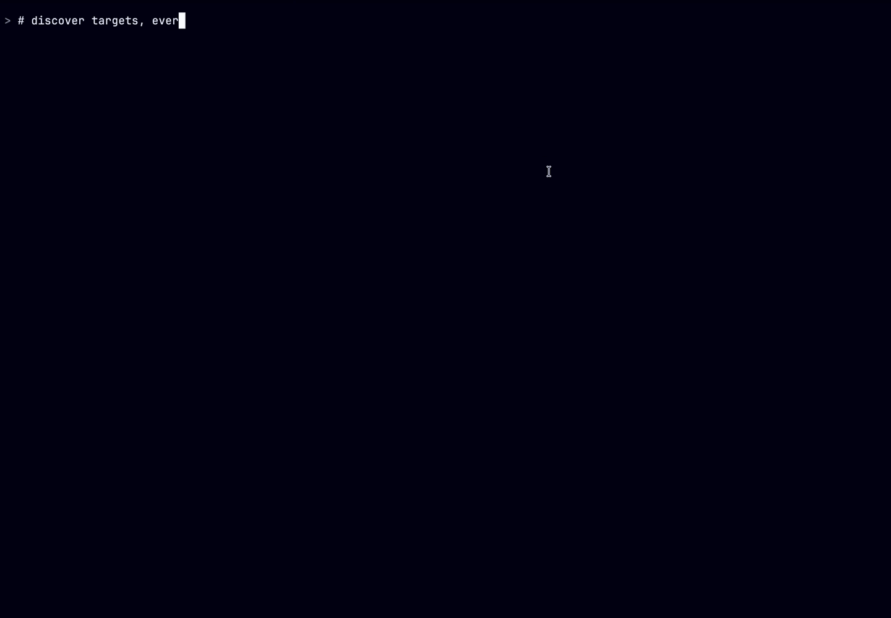

# awsmux

**Run one AWS CLI command across your whole fleet of accounts, safely.**

[](LICENSE)




One command, every account and region, identities verified before
anything runs, results merged into one stream. Anything that mutates is
stopped by an approval boundary that even an AI agent with your admin
credentials cannot talk its way past.

## Try it in 60 seconds (no AWS account needed)

```sh
go build -o awsmux . && ./awsmux demo
```

`awsmux demo` gives you a fictional 12-account fleet (payments, search,
platform, media, data, prod and stage) to break for fun. Zero
credentials, zero network calls, zero risk:

```sh
awsmux demo targets                                    # discover the fleet
awsmux demo run --format jsonl -- lambda list-functions   # one account is denied, on purpose
awsmux demo plan -- ec2 revoke-security-group-ingress \
  --group-id sg-0a1b2c3d --protocol tcp --port 22 --cidr 0.0.0.0/0
```

That last one is destructive, so it will not just run. You get an
immutable plan to approve first. Try editing the plan file between
approve and apply and watch the hash check refuse it.

## Real fleet

Same commands, minus `demo`. awsmux discovers profiles from your
existing AWS config (SSO or keys) and verifies every identity with STS
before running anything:

```sh
awsmux targets --regions us-east-1,us-west-2

awsmux run --profiles 'prod-*' --exclude '*-sandbox' --format jsonl \
  -- ec2 describe-instances --query 'Reservations[].Instances[].InstanceId'

awsmux plan -- ssm put-parameter --name /app/flag --value on --type String
awsmux approve plan-01k...          # prints a one-time token, never stored
awsmux apply plan-01k... --approval-token <token>
```

Useful flags: `--concurrency`, `--timeout 30s`, `--max-errors N`,
`--stop-on-access-denied`, `--dedupe` (collapse profiles that resolve to
the same account), `--output-dir` (one result file per target),
`--interactive` (checkbox target picker). Every run lands in
`awsmux history` and can be re-run with `awsmux replay`.

## Give it to your AI agent

```sh
claude mcp add awsmux -- /path/to/awsmux mcp
```

The agent gets five structured tools (`list_aws_targets`,
`plan_aws_operation`, `execute_aws_plan`, `get_aws_execution`,
`cancel_aws_execution`) instead of a raw shell. Read-only plans execute
freely. Anything else refuses until a human runs `awsmux approve` and
hands over the token, which binds to the plan's sha256 hash, so the
agent cannot alter an approved plan or execute it twice. Want to watch
an agent hit the boundary with zero blast radius? `awsmux demo mcp`
serves the fake fleet over MCP.

It is also measurably cheaper. Two identical agents did the same
three-region task, one with the raw aws CLI and one with awsmux:

| Measured from API transcripts | raw aws CLI | awsmux |
|---|---|---|
| Tool round trips | 7 | 3 |
| Model-generated tokens | 1,900 | 817 (57% fewer) |
| Total input tokens processed | 215,886 | 117,989 (45% fewer) |

The margin grows with fleet size: 30 accounts x 2 regions is 180 raw
CLI round trips versus still just 3 awsmux calls
([methodology](docs/ARCHITECTURE.md#token-efficiency-methodology)).

## Safety model

| Class | Examples | Policy |
|-------|----------|--------|
| `read_only` | describe-*, list-*, get-*, s3 ls | runs freely |
| `mutating` | create-*, put-*, update-*, s3 cp | `--yes`, interactive confirm, or approved plan |
| `destructive` | delete-*, terminate-*, revoke-*, s3 rm | never `--yes`; typed confirm or plan/approve/apply |
| `unknown` | anything unrecognized | treated as mutating |

Stable exit codes for CI and agents: 0 all succeeded, 1 some failed,
2 selection/config error, 3 approval required or rejected, 4 stopped by
threshold.

## The 03:00 story

A scanner pages: SSH is open to the world somewhere in the fleet. Your
agent sweeps 14 verified accounts in one read-only call, finds
`sg-0a1b2c3d` in payments-prod, and proposes the revoke. The revoke is
destructive, so the engine hands back a plan instead of running it. You
read the plan on your phone: exact command, exact account, verified
principal, hash. You approve, paste one token, and go back to sleep
while the fix lands in history with the hash attached.

You can replay this exact story offline right now: `awsmux demo`.

## How it compares

| | awsmux | awsrun | aws-vault / granted / awsume |
|---|---|---|---|
| Fleet execution across accounts | yes | yes | no (credential tools) |
| STS identity preflight per target | yes | no | n/a |
| Risk classification + approval boundary | yes | prompt only | n/a |
| Agent interface (MCP) | yes | no | no |
| Offline demo mode | yes | no | no |
| History + replay | yes | no | no |
| Runtime | single Go binary | Python + plugins | Go / varies |

The credential tools are complementary: awsmux happily executes through
profiles they manage.

## Docs

- [Architecture](docs/ARCHITECTURE.md): the engine, the plan boundary,
  the executor, demo mode internals.

## Development

```sh
go build ./... && go vet ./... && go test ./...
```

Dependencies: stdlib plus cobra. Roadmap: organization-aware discovery
(`--ou` plus role assumption), policy packs, Homebrew tap and release
binaries.

Licensed under [Apache-2.0](LICENSE).
