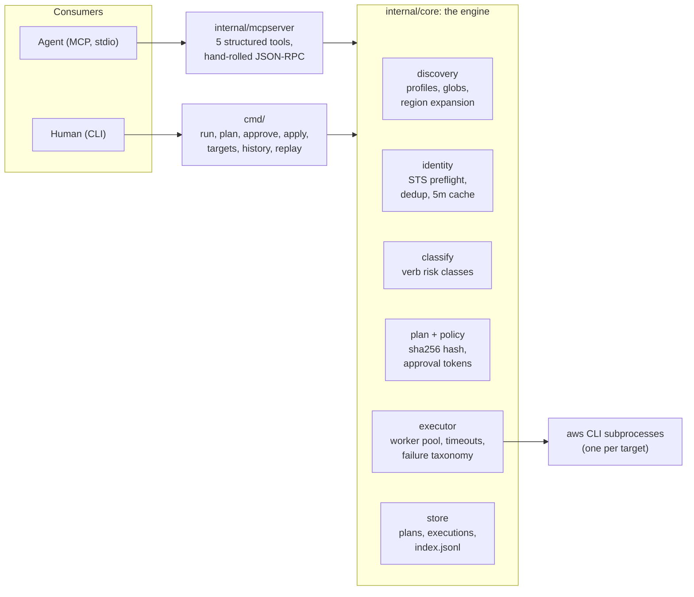
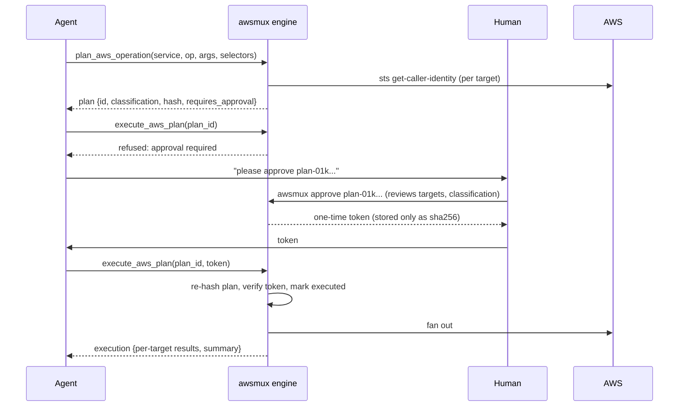

# awsmux

Mission control for the AWS CLI: run one operation across many profiles,
accounts, and regions with identity preflight, risk classification, an
approval boundary for anything that mutates, structured streaming output,
history, and replay.

awsmux is built agents-first. The primary interface is an MCP server with
a plan/approve/execute contract that an agent cannot bypass; the CLI is
the human layer over the same engine. If you point an AI agent at your
AWS estate, awsmux is the difference between "the model runs arbitrary
shell strings with admin credentials" and "the model proposes hashed,
classified, human-approved plans".

## The problem

Everyone with more than a couple of AWS accounts ends up writing this:

```sh
for profile in $(aws configure list-profiles); do
  aws --profile "$profile" ec2 describe-instances ...
done
```

These loops are bash-specific, unverified (profile names lie), weakly
structured, read-only by convention rather than enforcement, and
dangerous the day the command mutates something. Agents inherit all of
those problems and add a new one: every raw CLI round trip burns context
tokens. awsmux productizes the workflow.

## Quick start

```sh
go build -o awsmux .

# Discover targets: profiles x regions, each verified via sts get-caller-identity
awsmux targets --regions us-east-1,us-west-2

# Read-only fleet run, streamed as JSONL
awsmux run --profiles 'prod-*' --exclude '*-sandbox' --regions us-east-1,us-west-2 \
  --format jsonl -- ec2 describe-instances --query 'Reservations[].Instances[].InstanceId'

# Anything mutating goes through the plan boundary
awsmux plan --regions us-east-1 -- ssm put-parameter --name /app/flag --value on --type String
awsmux approve plan-01k...          # prints a one-time token, never stored
awsmux apply plan-01k... --approval-token <token>
```

Requires the AWS CLI v2 on PATH with working profiles (SSO or keys).

## Architecture



Both consumers converge on one engine, so an agent and a human see the
same targets, the same classification, and the same approval rules.
Design decisions worth knowing:

- **awsmux shells out to the AWS CLI** instead of embedding an SDK. That
  keeps every AWS service and every `--query` expression instantly
  available, reuses your existing credential machinery (SSO included),
  and means awsmux never lags behind new AWS APIs.
- **Identity is never inferred from profile names.** Every target is
  verified with `sts:GetCallerIdentity` before anything runs, cached for
  five minutes. Duplicate targets (same account, principal, and region
  under two profile names) are detected and can be collapsed with
  `--dedupe`.
- **Dependencies: stdlib plus cobra.** The MCP layer is hand-rolled
  ndjson JSON-RPC 2.0 over stdio, about 300 lines, nothing to upgrade.

### The plan boundary

The core safety idea: separate deciding what to do from being allowed to
do it, and make the artifact in between immutable.



The plan hash is a sha256 over service, operation, args, every verified
target identity (profile, region, account id, principal ARN), the
classification, the policy version, and the expiry. The approval token
binds to that hash. Consequences:

- The agent cannot alter a plan between approval and execution; any edit
  changes the hash and the apply refuses with "plan was modified after
  approval".
- A plan executes at most once, is useless after its TTL (default 1h),
  and the raw token is printed exactly once and never stored.
- There is no code path that executes a non-read-only plan without a
  valid token. Not a flag, not an env var, nothing for an agent to find.

### The executor

A worker pool (default concurrency 4) fans the command out per target,
with per-target timeouts, and classifies every failure into a stable
taxonomy: `success`, `error`, `access_denied`, `credential_expired`,
`timeout`, `skipped`. Fleet-level guardrails mirror AWS Systems Manager
semantics: `--max-errors N` stops scheduling after N failures,
`--stop-on-access-denied` halts on the first permission wall, and a
halted run reports the remaining targets as `skipped` and exits 4.

Results stream as JSONL the moment each target finishes, in completion
order, while the stored execution preserves input order. Every run is
persisted to `~/.awsmux/executions/` and is replayable: `awsmux replay`
re-verifies identities and re-applies the safety gates fresh, so a
replay is a new decision, not a bypass.

## Safety model

Operations are classified by verb with service-specific overrides:

| Class | Examples | Policy |
|-------|----------|--------|
| `read_only` | describe-*, list-*, get-*, s3 ls, all of sts | runs freely |
| `mutating` | create-*, put-*, update-*, run-*, s3 cp | `--yes`, interactive confirm, or approved plan |
| `destructive` | delete-*, terminate-*, revoke-*, s3 rm | `run` refuses even with `--yes`; interactive typed confirm or plan/approve/apply |
| `unknown` | anything unrecognized | treated as mutating |

## Use cases

- **Incident blast radius.** "Which accounts have a security group open
  to 0.0.0.0/0 on port 22?" One read-only fleet run instead of an hour
  of profile hopping.
- **Guarded remediation.** Revoke that rule everywhere with one plan,
  one human approval, one execution, and a persistent audit record.
- **Security and compliance sweeps.** Enumerate IAM users, access key
  ages, public buckets, or unencrypted volumes across every account,
  merged into one JSONL stream for a pipeline or an agent to reason
  over.
- **Config drift audits.** Compare Lambda runtimes, EKS versions, or
  tag coverage across the fleet in one command with `--query`
  projection.
- **CI guardrails.** Stable exit codes make fleet checks scriptable:
  exit 0 means every account passed, exit 1 tells you exactly which
  ones did not (JSONL says why), exit 2 or 3 means the run never
  touched AWS.

### A live scenario: the 03:00 security page

PagerDuty fires: a scanner found SSH open to the world somewhere in the
platform fleet. The on-call engineer asks their agent to investigate.
The agent has awsmux's MCP tools and read access to nothing else.

The agent discovers verified targets, then sweeps the fleet (read-only,
so it runs immediately):

```
list_aws_targets {"profiles": ["platform-*"], "regions": ["us-east-1", "us-west-2"]}
-> 14 targets, every one verified against STS, 2 duplicates collapsed

plan_aws_operation {"service": "ec2", "operation": "describe-security-groups",
  "args": ["--filters", "Name=ip-permission.cidr,Values=0.0.0.0/0",
           "Name=ip-permission.from-port,Values=22",
           "--query", "SecurityGroups[].{id:GroupId,vpc:VpcId}"]}
-> classification read_only, requires_approval false
execute_aws_plan -> 14/14 succeeded in 3.1s, one JSONL line per account
```

The offender is `sg-0a1b2c3d` in `platform-payments`, us-east-1. The
agent proposes the fix, and here the boundary bites: revoke is
destructive, so the plan comes back `requires_approval: true` with a
hash. The engineer reviews exactly what will run and against which
verified account:

```
$ awsmux approve plan-01kxvsczq2ke0y015x48ckp11p

Plan               plan-01kxvsczq2ke0y015x48ckp11p
Command            "aws ec2 revoke-security-group-ingress --group-id sg-0a1b2c3d ..."
Classification     DESTRUCTIVE
Requires approval  yes

ID                          PROFILE            ACCOUNT       REGION     PRINCIPAL
platform-payments@us-east-1 platform-payments  111122223333  us-east-1  ops-admin

approval token (give this to the executor, it is not stored): 3f9c...
```

The engineer hands the token to the agent; the agent executes; the
execution lands in history with the plan hash attached. If the agent had
modified the plan after approval (different group, extra target), the
hash check would have refused it. Total human involvement: reading one
plan and pasting one token, from a phone, at 03:04.

## Token efficiency for agents

Measured, not asserted. Two identical agents (same model, same
instructions) were given the same task: collect the caller identity,
all VPC IDs with CIDRs, and ECS cluster names across three regions.
One agent used the plain aws CLI, the other used awsmux. Both produced
the identical correct answer.

| Metric (from the API transcripts) | plain aws CLI | awsmux | change |
|---|---|---|---|
| Tool round trips | 7 | 3 | 2.3x fewer |
| Assistant API turns | 11 | 6 | 1.8x fewer |
| Model-generated (output) tokens | 1,900 | 817 | 57% fewer |
| Total input tokens processed | 215,886 | 117,989 | 45% fewer |

Why it works: every raw CLI call is a full agentic round trip. The
model writes another command (output tokens are the expensive ones, and
per-target commands scale linearly with fleet size), then the whole
conversation is re-processed for the next turn, so cumulative input
grows roughly quadratically with the number of calls. awsmux collapses
per-target calls into one invocation per operation; the model writes
one short command regardless of fleet size and gets back one compact,
pre-labeled JSONL line per target, with status and account identity
attached so no follow-up "which output was which" reasoning is needed.

Honest fine print: at this tiny scale (3 targets) awsmux's per-target
JSONL framing actually made the raw result payload slightly larger
(~460 vs ~110 tokens); the measured savings come entirely from fewer
round trips and fewer generated commands. That is exactly why the
advantage grows with fleet size: at 30 accounts x 2 regions, the same
three operations are 180 CLI round trips (or a hand-written bash loop
the model must generate and then untangle unlabeled output from) versus
still just 3 awsmux calls, one line per target. The bigger the fleet,
the bigger the margin.

## Agent interface (MCP)

```sh
claude mcp add awsmux -- /path/to/awsmux mcp
```

Five tools: `list_aws_targets`, `plan_aws_operation`, `execute_aws_plan`
(synchronous by default, `wait: false` for async), `get_aws_execution`,
`cancel_aws_execution`. Domain failures (bad selector, missing approval)
come back as structured tool errors the agent can react to, never as
protocol faults.

## Exit codes (stable, for agents and CI)

| Code | Meaning |
|------|---------|
| 0 | all targets succeeded |
| 1 | one or more targets failed |
| 2 | selection or configuration error |
| 3 | approval required, invalid, or rejected |
| 4 | run stopped by --max-errors / --stop-on-access-denied |

## State

Everything lives in `~/.awsmux` (override with `AWSMUX_HOME`): `plans/`,
`executions/` plus `executions/index.jsonl`, and the 5-minute identity
cache. Plans keep only the sha256 of their approval token.

## Development

```sh
go build ./... && go vet ./... && go test ./...
```

Roadmap: organization-aware discovery (`--ou` plus role assumption),
policy packs (per-team allowed operations), output normalization into
cross-account resource tables.
