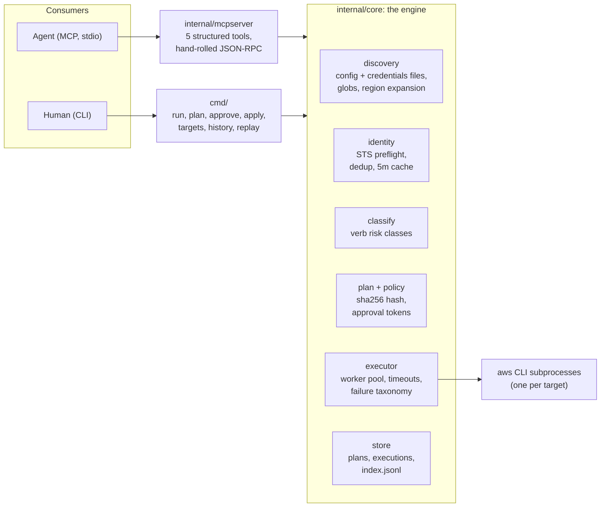
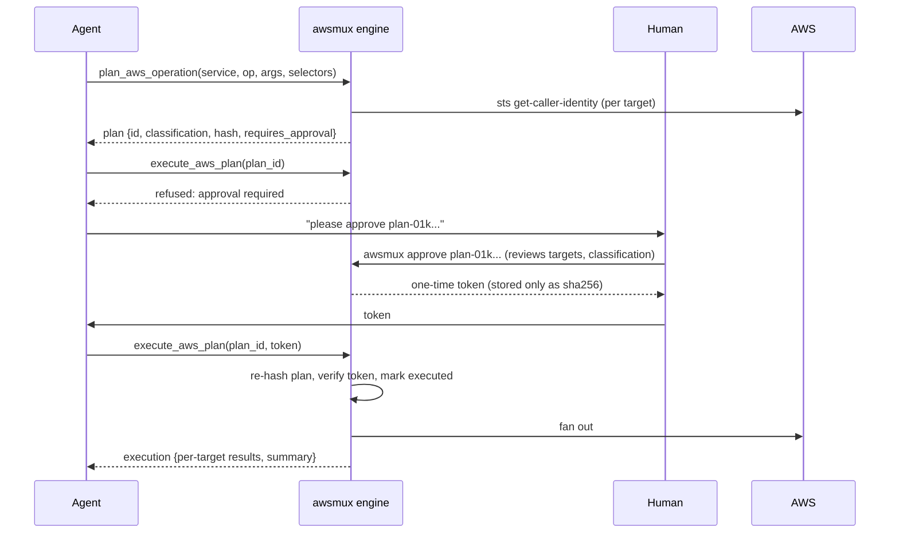

# awsmux architecture

Both consumers (agents over MCP, humans over the CLI) converge on one
engine, so they see the same targets, the same classification, and the
same approval rules.

## Design decisions

- **awsmux shells out to the AWS CLI** instead of embedding an SDK. That
  keeps every AWS service and every `--query` expression instantly
  available, reuses your existing credential machinery (SSO, static
  keys, and `credential_process` all pass straight through), and means
  awsmux never lags behind new AWS APIs. Tests swap the binary via
  `AWSMUX_AWS_BIN`, so every feature runs unchanged against a stand-in
  CLI with zero special-casing. Resolution order: the `AWSMUX_AWS_BIN`
  override, then PATH, then well-known install locations (Homebrew,
  the official installers, distro packages). The fallback matters for
  MCP: GUI-launched clients such as Claude Desktop spawn `awsmux mcp`
  with a minimal PATH that rarely includes the aws CLI. `awsmux
  doctor` reports the same resolution.
- **Discovery reads both shared AWS files.** Profiles come from the
  shared config file (`AWS_CONFIG_FILE` or `~/.aws/config`, `[profile
  x]` headers) and the shared credentials file
  (`AWS_SHARED_CREDENTIALS_FILE` or `~/.aws/credentials`, bare `[x]`
  headers taken verbatim). One profile per name: config order first,
  credentials-only profiles appended, and a non-empty credentials
  region overrides the config one (AWS CLI precedence). Each target
  reports its source (`config`, `credentials`, or `both`). Only the
  region key is read; credential material never is. `awsmux doctor`
  runs the same parse and reports which files were checked, per-file
  profile counts, aws CLI availability, and state-dir writability, so a
  first run that finds nothing explains itself.
- **Identity is never inferred from profile names.** Every target is
  verified with `sts:GetCallerIdentity` before anything runs, cached for
  five minutes. Duplicate targets (same account, principal, and region
  under two profile names) are detected and can be collapsed with
  `--dedupe`.
- **Dependencies: stdlib plus cobra.** The MCP layer is hand-rolled
  ndjson JSON-RPC 2.0 over stdio, about 300 lines, nothing to upgrade.

## The plan boundary

The core safety idea: separate deciding what to do from being allowed to
do it, and make the artifact in between immutable.

The plan hash is a sha256 over service, operation, args, every verified
target identity (profile, region, account id, principal ARN), the
classification, the policy version, and the expiry. The approval token
binds to that hash. Consequences:

- The agent cannot alter a plan between approval and execution; any edit
  changes the hash and the apply refuses with "plan was modified after
  approval".
- A plan executes at most once, is useless after its TTL (default 1h),
  and the raw token is printed exactly once and never stored.
- There is no code path that executes a non-read-only plan without a
  valid token. Not a flag, not an env var, nothing for an agent to find.

## The executor

A worker pool (default concurrency 100, sized for fleet-wide fan-out;
each in-flight target is one aws CLI subprocess) fans the command out
per target,
with per-target timeouts, and classifies every failure into a stable
taxonomy: `success`, `error`, `access_denied`, `credential_expired`,
`timeout`, `skipped`. Fleet-level guardrails mirror AWS Systems Manager
semantics: `--max-errors N` stops scheduling after N failures,
`--stop-on-access-denied` halts on the first permission wall, and a
halted run reports the remaining targets as `skipped` and exits 4.

Results stream as JSONL the moment each target finishes, in completion
order, while the stored execution preserves input order. Every run is
persisted and replayable: `awsmux replay` re-verifies identities and
re-applies the safety gates fresh, so a replay is a new decision, not a
bypass.

## Test fleet

`make fleet-up` runs `scripts/fleet` (a stdlib-only dev tool, not part
of the awsmux binary): it boots a pinned `localstack/localstack:3.8`
container (the last fully license-free community line) and generates an
`AWS_CONFIG_FILE` and credentials file under `.tmp/fleet/` describing a
fictional 101-profile fleet (10 teams x prod/stage x 5 shards, 3
regions, plus one deliberate duplicate profile so `--dedupe` has
something to find; `FLEET_TEAMS` / `FLEET_SHARDS` shrink it). Each
profile's `endpoint_url` points at LocalStack and its access key is its
12-digit account ID, which LocalStack uses to namespace resources per
account, so STS preflight verifies real per-account identities and
mutations genuinely persist. State is isolated via
`AWSMUX_HOME=.tmp/fleet/home`; `source .tmp/fleet/env.sh` exports
everything. Provisioning seeds a few storyline resources once per
container (a `.seeded` marker holds the container ID, so a recreated
container reseeds), most importantly the payments-prod-1 security group
that is open to the world.

`make e2e` runs `scripts/e2e.sh` against that fleet: discovery with STS
verification of every profile (each sourced from both shared files),
a healthy `doctor` report, dedupe of the planted duplicate,
fleet-wide read-only fan-out, the approval gate refusing an unapproved
mutation with exit 3, and a full plan / approve / apply roundtrip. CI
runs the identical script in the "e2e (LocalStack)" job on ubuntu. The
real engine, policy, and MCP server run byte-for-byte identical code
against the fleet. Reset with `make fleet-down` (container) and
`make clean` (files).

## State

Everything lives in `~/.awsmux` (override with `AWSMUX_HOME`): `plans/`,
`executions/` plus `executions/index.jsonl`, and the 5-minute identity
cache. Plans keep only the sha256 of their approval token.

## Token-efficiency methodology

The cost and speed numbers in the README come from a 150-session,
three-arm A/B benchmark with hermetic tool surfaces, ground-truth
grading, and permutation-test statistics. The full design, results,
and caveats live in [BENCHMARK.md](BENCHMARK.md).
